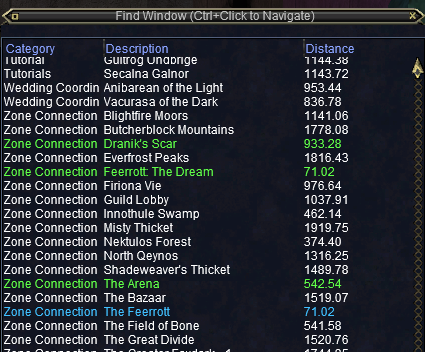

---
tags:
  - plugin
resource_link: "https://www.redguides.com/community/resources/mq2easyfind.119/"
support_link: "https://www.redguides.com/community/threads/mq2easyfind.64009/"
repository: "https://github.com/brainiac/MQ2EasyFind"
config: "EasyFind.yaml, ZoneConnections.yaml"
authors: "eqmule, brainiac, Knightly, Kazadoom_32"
tagline: "EasyFind is a plugin that helps get you around EverQuest"
acknowledgements: "MQ2Nav"
---

# MQ2EasyFind

<!--desc-start-->
EasyFind is a plugin that helps get you around EverQuest, and while the heavy lifting and actual character movement is provided by the [Nav](../mq2nav/index.md) plugin, EasyFind tells it where to go.
<!--desc-end-->

EasyFind provides two main categories of functionality:

1. Finding locations in the current zone.  
2. Navigating to other zones.

You can interact with this plugin in the following ways:

  - Ctrl+click on items in the Find window (opens with Ctrl+F by default)

  - The /easyfind command - find locations in the current zone

  - The /travelto command - travel to another zone

You can also access settings for EasyFind through [/mqsettings](../macroquest/reference/commands/mqsettings.md).

## Commands

<a href="cmd-easyfind/">

</a>
:     {{ readMore('projects/mq2easyfind/cmd-easyfind.md') }}

<a href="cmd-travelto/">

</a>
:     {{ readMore('projects/mq2easyfind/cmd-travelto.md') }}


### EasyFind.yaml

It's best to configure EasyFind's settings through the user interface, `/easyfind ui`, but here's an example `config/EasyFind.yaml`,

``` { .yaml .annotate }
GroupPlugin: auto # (1)!
GlobalLogLevel: info # (2)!
DisabledTransferTypes: [] # (3)!
ColoredFindWindow: true # (4)!
DistanceColumn: true # (5)!
SilentGroupCommands: true # (6)!
VerboseMessages: false # (7)!
NavLogLevel: error # (8)!
IgnoreZoneConnectionData: false # (9)!
Colors: # (10)!
    AddedLocation: "#60ff48"    # (11)!
    ModifiedLocation: "#40c0ff" # (12)!
```

1. Select the plugin that should be used for issuing commands to your group (auto, dannet, eqbc, none). Default: auto
2. The global log level. Default: info
3. Disabled transfer types, e.g. Portal, Tree, Rubble, etc. Best set through the UI. Default: []
4. Colorize Customized Entries in Find Window. Default: true
5. Display Distance Column in Find Window. Default: true
6. If checked, eqbc and dannet commands will be squelched. Default: true
7. If checked, some messages will contain additional status information. Default: false
8. Controls Nav messages while driven by EasyFind. Default: error
9. Populate connections entirely from ZoneConnections.yaml for servers that don't send zone connection data. Default: false
10. Color settings for added and customized locations
11. Added Locations. Default: #60ff48
12. Modified Locations. Default: #40c0ff

### ZoneConnections.yaml

EasyFind uses the Zone Guide to find connections between zones, so that it can plot a course with /travelto. Sometimes these connections are not reliable, so we use ZoneConnections.yaml to fill in the blanks. We use this yaml file for teleport NPCs because the Zone Guide and find window doesn't provide any information about them, so if they are not in the yaml file, they will not be usable.

This file can be edited, but it will be overwritten during patches. You are encouraged to submit any fixes to the linked repository so they can be shared by all. What follows is a partial example with comments, 

`resources/EasyFind/ZoneConnections.yaml`

``` { .yaml .annotate }
FindLocations:
    southro: # (1)!
        -   type: Translocator # (2)!
            name: Magus Jerira # (3)!
            keyword: Nedaria's Landing # (4)!
            targetZone: nedaria # (5)!
            expansion: Lost Dungeons of Norrath # (6)!
        -   type: Translocator
            name: Magus Jerira
            destinations: # (7)!
                -   keyword: Butcherblock
                    targetZone: butcher
                -   keyword: Commonlands
                    targetZone: commonlands
                -   keyword: Everfrost
                    targetZone: everfrost
                -   keyword: North Ro
                    targetZone: northro
            expansion: Lost Dungeons of Norrath
            requiredAchievement: 500980300 # (8)!
            requiredAchievementName: "Achievement Name" # (9)!
    poknowledge:
        -   type: ZoneConnection
            switch: 20
            targetZone: everfrost
            replace: false # (10)!
        -   type: ZoneConnection
            targetZone: feerrott2
            name: 'Feerrott: The Dream' # (11)!
            switch: 4 # (12)!  
            script: | # (13)!
                -- Wait for window to open and click the button on the left
                mq.delay('5s', function() return mq.TLO.Window('LargeDialogWindow').Open() end)
                if mq.TLO.Window('LargeDialogWindow').Open() then
                    mq.TLO.Window('LargeDialogWindow/LDW_YesButton').LeftMouseUp()
                end
            scriptFile: example.lua # (14)!
            expansion: House of Thule
    maiden:
        -   type: ZoneConnection
            location: [-2290, 95, -160] # (15)!
            targetZone: akheva
            identifier: 2 # (16)!
        -   type: ZoneConnection
            location: [-2310, 235, -160]
            targetZone: akheva
            identifier: 1
        -   type: ZoneConnection
            targetZone: badzone
            remove: true # (17)!
```

1. Zone short name
2. Type of connection (Translocator or ZoneConnection)
3. Name of the translocator. If the name includes a hash sign, wrap it in quotes, e.g. '#Translocator Deela'
4. The phrase your character must say to the translocator
5. Target zone's short name
6. Expansion where this zone is first required
7. When a translocator offers multiple destinations
8. Achievement ID required for this Translocator
9. Achievement name required for this Translocator
10. If false, don't replace any built-in information if it exists
11. Zone long name
12. Switch ID; the switch name is also accepted, e.g. POKOGPORT500
13. Lua script to run once arriving at the switch
14. Alternative to inline script
15. If you walk across a zone-line, provide the location
16. If multiple entrances to the same zone exist, list the unique identifier
17. Remove an unwanted connection from the Zone Guide

Switch names and ID's can be found with [/doors](../macroquest/reference/commands/doors.md)

### ZoneGuide.yaml

A third YAML file, `resources/ZoneGuide.yaml`, is created when you run `/travelto dump`. This is not a config file, rather it's a collection of interesting zone information sent from the server to the client, which provides us an easy way to tell if and when something has changed. It contains information on continents, zone types, transfer types, ID's, min level, max level, basically everything you want to know about zones.

## Find Window
{ align=right width=250 loading=lazy }

*EverQuest's* in-game Find Window is opened by default with ++ctrl+f++, and EasyFind modifies this in some neat ways. 

!!! tip "Navigation Controls"

    - ++ctrl+left-button++ on destination to move there with Nav
    - ++ctrl+shift+left-button++ for group to move to destination with Nav

EasyFind uses the Find window to find locations in the 
current zone. This list can be augmented by modifying the 
`ZoneConnections.yaml` as described above.  
Sometimes existing locations in the find window do not have enough information (or the information is inaccurate) and edits need to be made to make them findable. 

!!! info "Color Coding"

    By default, zone names are color-coded in the Find window:

    - 🟢 **Green** - locations added by EasyFind
    - ⚪ **White** - default EverQuest locations  
    - 🔵 **Blue** - locations modified by EasyFind

## TLO Members

The TLO [EasyFind](tlo-easyfind.md) includes the following members




## See also

- [Nav](../mq2nav/index.md)
- [MQ2EasyFind Preview Vid](https://www.youtube.com/watch?v=qw_eI8jmfpo) by Sic.
- [Zone short names](../everquest/general/zone-short-names.md)
